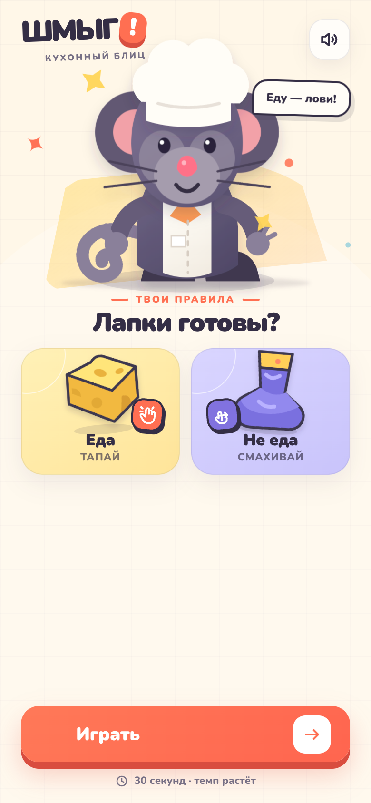
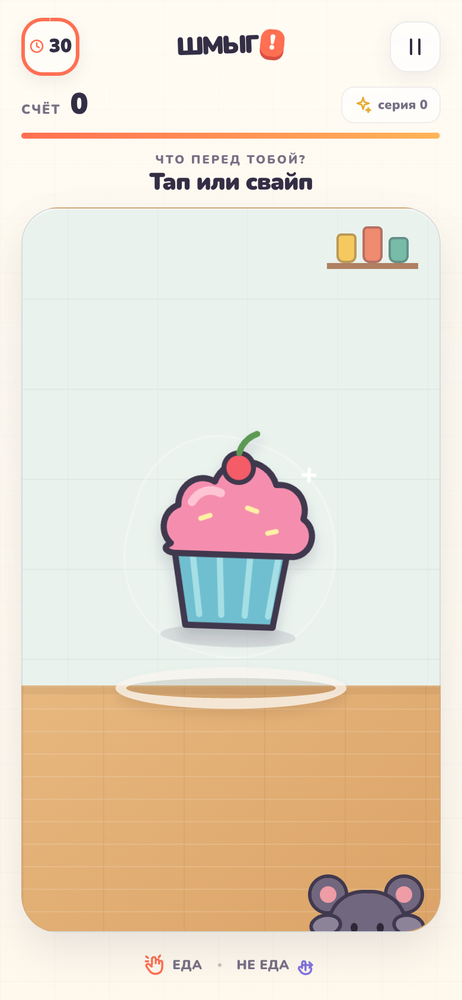
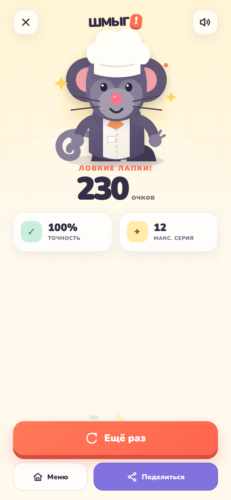

# Шмыг! — кухонный блиц 🐭

Мобильная веб-игра для Telegram Mini Apps. Игрок помогает шустрому крысёнку-шефу разобрать кухонную путаницу: **еду нужно тапнуть**, а **несъедобный предмет — смахнуть в любую сторону**.

<p align="center">
  
  
  
</p>

## Что уже работает

- 30-секундная игровая сессия с ускорением темпа;
- распознавание тапа и свайпа в любом направлении;
- 16 авторских векторных предметов: 8 съедобных и 8 несъедобных;
- серии правильных ответов и множитель очков до `×4`;
- штраф за ошибку, точность, максимальная серия и личный рекорд;
- экран паузы, обратный отсчёт и возможность поделиться результатом;
- адаптация под маленькие экраны и safe-area Telegram;
- управление с клавиатуры: `Space` / `Enter` — тап, стрелки — свайп;
- встроенные звуки через Web Audio API без внешних аудиофайлов;
- CSS/SVG-анимации персонажа, предметов, частиц, реакций и конфетти;
- полноценная интеграция с Telegram WebApp API.

### Виброотклик

Каждый игровой тап сразу вызывает `HapticFeedback.impactOccurred('light')`. Для свайпа используется более заметный `medium`, а правильный или ошибочный ответ получает отдельный тактильный паттерн. В обычном мобильном браузере используется fallback через `navigator.vibrate()`.

## Запуск локально

```bash
npm install
npm run dev
```

Приложение откроется на `http://localhost:5173`.

Проверка production-сборки:

```bash
npm run build
npm run preview
```

## Подключение к Telegram

1. Соберите проект командой `npm run build`.
2. Разместите содержимое `dist/` на любом HTTPS-хостинге (Vercel, Netlify, Cloudflare Pages и т. п.).
3. Создайте бота через [@BotFather](https://t.me/BotFather).
4. Выполните `/newapp`, выберите бота и укажите HTTPS-адрес приложения.
5. При необходимости добавьте кнопку запуска через `/setmenubutton`.

На старте приложение само вызывает `ready()`, `expand()`, настраивает цвета, Telegram Back Button и блокирует вертикальные свайпы во время раунда, чтобы они не конфликтовали с управлением.

## Стек

- React 19 + TypeScript
- Vite
- Telegram WebApp API
- SVG + CSS animations
- Web Audio API

Все игровые иллюстрации и анимации находятся в репозитории; внешние изображения и платные ассеты не используются.
